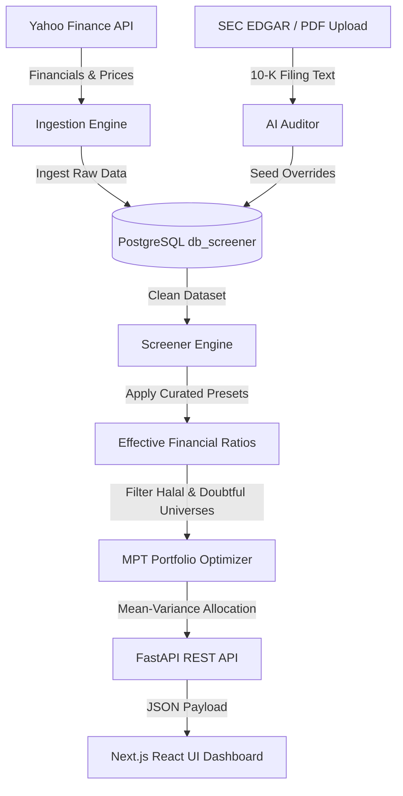

# 🌙 Shariah-Compliant Portfolio Optimizer & AI Analyst

A professional-grade fintech platform that automates Shariah compliance screening and applies Modern Portfolio Theory (MPT) to build optimized, ethically-aligned investment portfolios. 

This service is decoupled into a high-performance **FastAPI backend** and a modern **Next.js React frontend**, integrated with a unified multi-tenant **PostgreSQL database**.



---

## 🚀 Key Features & Architectural Patterns

### 1. Decoupled Presentation & API Layers
*   **FastAPI Backend (`src/api.py`)**: Exposes structured RESTful endpoints for retrieving compliance universes, triggering ingestion/scans, executing portfolio optimization runs, and saving manual overrides.
*   **Next.js Frontend (`frontend/`)**: Built using React, TypeScript, and Tailwind CSS v4. Features search-and-filter datagrids, dynamic portfolio allocation charts (using Recharts), and modal systems for proposing manual audit overrides.

### 2. Multi-Provider LLM Failover Routing
The audit pipeline features a custom failover router to guarantee high availability and bypass API quota limitations:
*   **Primary Path**: Google Gemini API is called via a priority model chain (`gemini-3.1-flash-lite`, `gemini-2.5-flash`).
*   **Failover Path**: On catching `429 (Too Many Requests)` rate-limit exceptions, the system automatically redirects the audit payload to OpenAI (`gpt-4o-mini`).
*   **Portability**: Enforces structured JSON output matching strict schemas across both providers, preventing JSON parser errors during failovers.

### 3. Programmatic Yield & Securities Correction
To resolve data gaps in raw APIs (like Yahoo Finance missing consolidated lines or marketable investments), the ingestion engine implements deterministic financial proxies:
*   **Marketable Securities Aggregator**: Integrates current and long-term available-for-sale securities into the Cash Screen numerator to calculate liquid portfolios accurately (e.g. Apple's true 4.47% ratio vs. 1.09% simple cash).
*   **Interest Income Deduction**: Automatically deduces interest income using a conservative **3.0% annual yield proxy** on the total cash and marketable securities portfolio if the reported value is missing or `NaN`.

### 4. Curated Benchmark Presets
For major market-cap stocks (e.g., AAPL, MSFT, GOOG, META), the screener applies a **Curated Benchmark Layer** based on verified professional standards (e.g., Musaffa):
*   Ensures 100% compliance precision for popular holdings, bypassing stochastic LLM math errors.
*   **Precedence Hierarchy**: `Manual User Overrides` (Highest) $\rightarrow$ `Curated Benchmarks` $\rightarrow$ `AI Audits` $\rightarrow$ `Calculated Baseline` (Lowest).

### 5. Mean-Variance Portfolio Optimizer
Implements Markowitz Modern Portfolio Theory (MPT) using `scipy.optimize` supporting multiple investment strategies:
*   **Max Sharpe Ratio**: Maximizes return relative to risk.
*   **Minimum Volatility**: Minimizes overall portfolio risk.
*   **Doubtful Stock Toggle**: An adjustable frontend toggle allows users to include or exclude stocks classified in the `doubtful_universe` inside optimization runs.
*   **Constraints**: Enforces full investment, individual asset concentration limits (default 10%), and sector concentration limits (default 30%).

---

## 🧮 Compliance & Optimization Mathematics

### 1. Financial Ratio Thresholds (AAOIFI Standard)
A company is screened and classified as Shariah-compliant if it satisfies:
$$\text{Debt Ratio} = \frac{\text{Interest-Bearing Debt}}{\text{36-Mo Avg Market Cap}} < 30.0\%$$
$$\text{Securities Ratio} = \frac{\text{Cash + Marketable Securities}}{\text{36-Mo Avg Market Cap}} < 30.0\%$$
$$\text{Receivables Ratio} = \frac{\text{Accounts Receivable}}{\text{Total Assets}} < 45.0\%$$
$$\text{Tangibility Ratio} = \frac{\text{Total Assets} - (\text{Cash} + \text{Accounts Receivable})}{\text{Total Assets}} \ge 30.0\%$$

### 2. Revenue Thresholds & Universe Partitioning
*   **Halal Revenue Ratio**: $\text{Haram Revenue Ratio} = \frac{\text{Haram Revenue} + \text{Doubtful Revenue} + \text{Interest Income}}{\text{Total Revenue}} < 5.0\%$
*   **Doubtful Partitioning**: Stocks that pass all financial ratios and business screens, but exceed the combined revenue limit (combined Haram + Doubtful revenue ratio $\ge 5.0\%$) are isolated in the `doubtful_universe` database table rather than being completely rejected.

### 3. Modern Portfolio Theory Optimization
The optimizer seeks to maximize the Sharpe Ratio ($S_p$):
$$S_p = \frac{E[R_p] - R_f}{\sigma_p}$$

Subject to:
$$\sum w_i = 1 \quad \text{(Full Investment)}$$
$$0 \le w_i \le 0.10 \quad \text{(Concentration Cap)}$$
$$A_{\text{sector}} \cdot w \le 0.30 \quad \text{(Sector Exposure Cap)}$$

---

## 🛠️ Tech Stack

*   **FastAPI Backend**: Python 3.10+, SciPy, NumPy, Pandas, Scikit-Learn (Ledoit-Wolf Shrinkage), SQLAlchemy (asyncpg), Uvicorn.
*   **Next.js Frontend**: React 19, TypeScript, Tailwind CSS v4, Recharts, ESLint.
*   **Database**: PostgreSQL 15 (Consolidated monorepo container).
*   **Testing**: Pytest (93 E2E and Unit test cases).

---

## 🏗️ Getting Started & Setup

### 🐳 Running with Docker Compose (Recommended)
This service is designed to run as part of the Aegis Platform monorepo. Start the backend and frontend services using Docker:

1.  **Start Services**:
    ```bash
    # From the repository root
    docker-compose up --build shariah-screener shariah-screener-ui
    ```
2.  **Access points**:
    *   **Frontend Dashboard**
    *   **FastAPI Swagger Docs**

---

### 💻 Manual Local Execution (For Development)

#### 1. Setup Backend
1.  Navigate to the directory and activate virtual env:
    ```bash
    cd services/shariahcompliantscreener
    python -m venv venv
    source venv/bin/activate  # Windows: venv\Scripts\activate
    pip install -r requirements.lock
    ```
2.  Configure `.env` in the current directory:
    ```env
    DATABASE_URL=postgresql+asyncpg://
    GEMINI_API_KEY=your_gemini_key_here
    OPENAI_API_KEY=your_openai_key_here
    ```
3.  Ingest financial data & run the screener:
    ```bash
    python main.py ingest
    python main.py screener
    ```
4.  Start the FastAPI Server:
    ```bash
    uvicorn src.api:app --host 0.0.0.0 --port 8001 --reload
    ```

#### 2. Setup Frontend
1.  Navigate to the frontend folder and install dependencies:
    ```bash
    cd services/shariahcompliantscreener/frontend
    npm install
    ```
2.  Run the development server:
    ```bash
    npm run dev
    ```
3.  Open [http://localhost:3000](http://localhost:3000) to view the client.

---

## 🧪 Testing Suite

The testing framework includes 93 fully automated opaque-box E2E and unit tests partitioned across four distinct tiers of testing.

*   To run the tests inside the Docker container environment:
    ```bash
    docker exec shariahscreener pytest
    ```
*   To run only the newly created opaque-box E2E test suite (Tiers 1-4):
    ```bash
    docker exec shariahscreener pytest -v tests/e2e/
    ```
