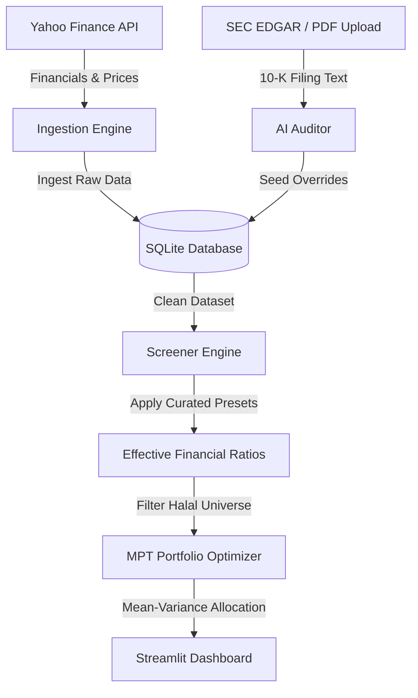

# 🌙 Shariah-Compliant Portfolio Optimizer & AI Analyst

A professional-grade fintech platform that automates Shariah compliance screening and applies Modern Portfolio Theory (MPT) to build optimized, ethically-aligned investment portfolios. 

This project is built with a focus on robust software engineering practices, featuring multi-provider LLM failover routing, deterministic financial correction proxies, programmatic asset checks, and full automated test coverage.



---

## 🚀 Key Features & Architectural Patterns

### 1. Multi-Provider LLM Failover Routing
The audit pipeline features a custom failover router to guarantee high availability and bypass API quota limitations:
*   **Primary Path**: Google Gemini API is called via a priority model chain (`gemini-3.1-flash-lite`, `gemini-2.5-flash`).
*   **Failover Path**: On catching `429 (Too Many Requests)` rate-limit or daily quota exceptions, the system automatically redirects the audit payload to OpenAI (`gpt-4o-mini`) using lightweight HTTP requests.
*   **Portability**: Enforces structured JSON output matching strict schemas across both providers, preventing JSON parser errors during failovers.

### 2. Programmatic Yield & Securities Correction
To resolve data gaps in raw APIs (like Yahoo Finance missing consolidated lines or marketable investments), the ingestion engine implements deterministic financial proxies:
*   **Marketable Securities Aggregator**: Integrates current and long-term available-for-sale securities into the Cash Screen numerator to calculate liquid portfolios accurately (e.g. Apple's true 4.47% ratio vs. 1.09% simple cash).
*   **Interest Income Deduction**: Automatically deduces interest income using a conservative **3.0% annual yield proxy** on the total cash and marketable securities portfolio if the reported value is missing or `NaN`.

### 3. Curated Benchmark Presets
For major market-cap stocks (e.g., AAPL, MSFT, GOOG, META), the screener applies a **Curated Benchmark Layer** based on verified professional standards (e.g. Musaffa):
*   Ensures 100% compliance precision for popular holdings, bypassing stochastic LLM math errors.
*   **Precedence Hierarchy**: `Manual User Overrides` (Highest) $\rightarrow$ `Curated Benchmarks` $\rightarrow$ `AI Audits` $\rightarrow$ `Calculated Baseline` (Lowest).

### 4. Mean-Variance Portfolio Optimizer
Implements Markowitz Modern Portfolio Theory (MPT) using `scipy.optimize` supporting multiple investment strategies:
*   **Max Sharpe Ratio**: Maximizes return relative to risk.
*   **Minimum Volatility**: Minimizes overall portfolio risk.
*   **Constraints**: Enforces full investment, individual asset concentration limits (default 10%), and sector concentration limits (default 30%).

---

## 🧮 Compliance & Optimization Mathematics

### 1. Financial Ratio Thresholds (AAOIFI Standard)
A company is screened and classified as Shariah-compliant if it satisfies:
$$\text{Debt Ratio} = \frac{\text{Interest-Bearing Debt}}{\text{36-Mo Avg Market Cap}} < 30.0\%$$
$$\text{Securities Ratio} = \frac{\text{Cash + Marketable Securities}}{\text{36-Mo Avg Market Cap}} < 30.0\%$$
$$\text{Receivables Ratio} = \frac{\text{Accounts Receivable}}{\text{Total Assets}} < 45.0\%$$
$$\text{Haram Revenue Ratio} = \frac{\text{Haram Revenue} + \text{Doubtful Revenue} + \text{Interest Income}}{\text{Total Revenue}} < 5.0\%$$

### 2. Modern Portfolio Theory Optimization
The optimizer seeks to maximize the Sharpe Ratio ($S_p$):
$$S_p = \frac{E[R_p] - R_f}{\sigma_p}$$

Subject to:
$$\sum w_i = 1 \quad \text{(Full Investment)}$$
$$0 \le w_i \le 0.10 \quad \text{(Concentration Cap)}$$
$$A_{\text{sector}} \cdot w \le 0.30 \quad \text{(Sector Exposure Cap)}$$

---

## 🛠️ Tech Stack

*   **Language**: Python 3.10+
*   **Math & Optimization**: SciPy, NumPy, Pandas, Scikit-Learn (Ledoit-Wolf Shrinkage)
*   **AI / LLM Clients**: Google Generative AI SDK, Custom OpenAI REST Client
*   **Database**: SQLite3
*   **Testing**: Pytest
*   **Frontend**: Streamlit

---

## 🏗️ Installation & Setup

1. **Clone the Repository:**
   ```bash
   git clone https://github.com/yourusername/shariah-compliant-optimizer.git
   cd shariah-compliant-optimizer
   ```

2. **Set up Virtual Environment & Install Dependencies:**
   ```bash
   python -m venv venv
   source venv/bin/activate  # On Windows use: venv\Scripts\activate
   pip install -r requirements.txt
   ```

3. **Configure Environment Variables:**
   Create a `.env` file in the project root:
   ```env
   GEMINI_API_KEY=your_gemini_api_key_here
   OPENAI_API_KEY=your_openai_api_key_here  # Optional: For fallback failover
   ```

4. **Ingest Financial Data:**
   Seed your local SQLite database with raw financial records for your stock universe:
   ```bash
   python main.py ingest
   ```

5. **Launch the Dashboard:**
   ```bash
   streamlit run app.py
   ```

---

## 🧪 Testing Suite
The core engine features complete test coverage for all ingestion, screening, optimization, and document uploading modules.

Run the test suite using `pytest`:
```bash
pytest
```

---

## 🐳 Docker Execution
To run the web app in a containerized sandbox environment:

1. **Build the Docker Image:**
   ```bash
   docker build -t shariah-screener .
   ```

2. **Run the Container (Exposing port 8501):**
   ```bash
   docker run -p 8501:8501 --env-file .env shariah-screener
   ```
   Open your browser to `http://localhost:8501` to view the dashboard.
